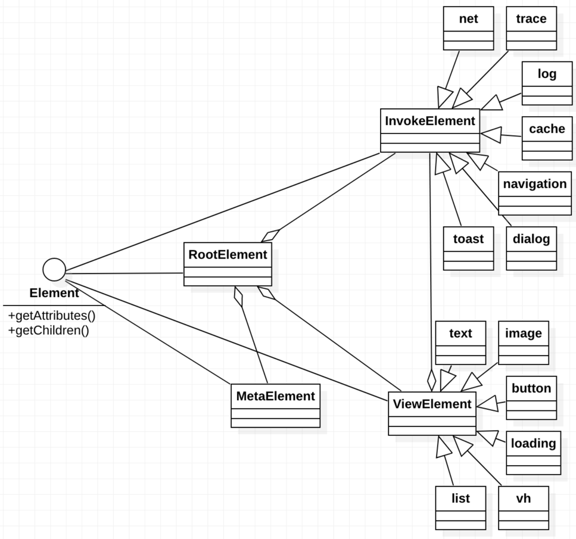
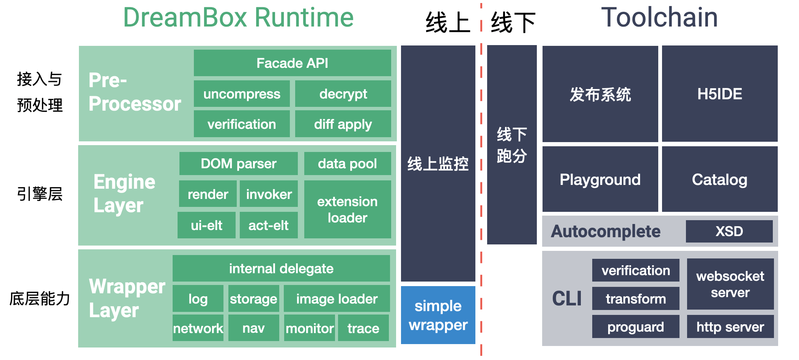
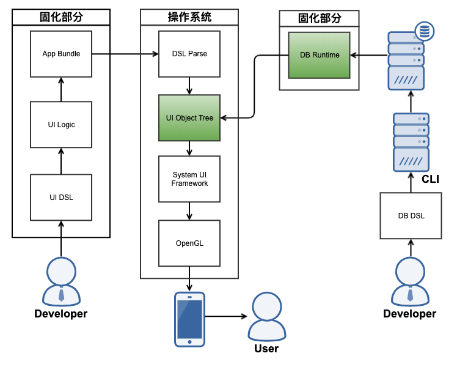

## DreamBox设计思路

DB根据以下几点原则进行设计开发：

- 易用，快速上手，不要陡峭的学习曲线
- 能用，真正能快速应用到业务中，唯快不破
- 好用，能在双端统一覆盖期待的应用场景

### 目标覆盖场景

静态视图 & 简单交互逻辑

### DSL的设计理念

遵循一个原则：节点即所有。
 
包括视图渲染和交互、生命周期逻辑，以及后续的动作触发都用节点表示。DreamBox的Runtime为了保持简单在内部不做动态语义解析。

### DB节点设计

抽象上，为了遵循“节点即所有”的设计理念，节点的类图基础设计思路如上图所示。动作节点、视图节点都是基础节点的具体实现，包括未来接入方的扩展节点也是一样。
 
如XML的数据格式一样，对于DB Runtime来说至关重要的数据是节点的属性和子节点。最终会在运行时形成一个完整的节点树。

#### 节点

- 动作节点。动作节点的子节点只能是动作，可嵌套
- 视图节点。除复杂的视图容器节点（render、list都可理解为视图容器）外，其他视图节点只可能包含子的动作节点，不可嵌套。视图容器节点只可嵌套子视图节点

### DB框架设计

- Runtime作为SDK对开发者提供服务，并且客户端发版上线，在线上提供视图动态渲染能力
- Runtime中接入层提供对外API，并且对模板数据做校验和初步处理
- 引擎层解析DSL编译后的DOM Tree，组装视图树、绑定动作行为及数据。除支持内置标签外，还具备扩展加载机制，支持外部接入方扩展自己的标签。同时，还包含了数据池逻辑，承载业务数据和渲染数据的交互处理
- Runtime的最底层实现通过接口抽象的方式可由外部接入方进行定制。其中包括Runtime会用到的各种基础功能，如网络、日志、图片加载等，均通过接口形式先上提供支撑。这一层的设计使得DB Runtime可以更好的融入大型、成熟的业务工程中去
- 在线下，已经建立了一系列工具链方便DB开发和调试。同时也在尝试扩展新的线下工具加速DB的开发效率

### 在操作系统中的定位

- 左侧的固化部分为传统开发，开发者通过布局和运行时代码逻辑编写，最终将这部分资源和代码固化在App包中发布，最终在系统中被构建成视图树，进入系统UI框架然后被终端用户看到
- 右侧为DB的开发流程，开发者在线下通过DSL的编写，测试通过后将渲染模板数据发布到线上，最终这部分数据通过固化在已发版App中的Runtime接管到手机操作系统的UI框架中被终端用户看到

可以看到，DB是在操作系统的原生UI框架上实现了自己的微型DSL解析框架，通过相对固定的解析规则达成目标场景中的需求开发。自由度上是不如原生的，但具备动态化能力。

### 接入设计

DreamBox提供`accessKey`的概念，一个App可能只对应一个accessKey，也可能因为存在多个纵向业务而对应着多个accessKey。如`pool`、wrapper等在accessKey维度上拥有唯一对应的对象实例。所以在Runtime的初始化和一些关键环节上，总是需要接入方传入他的accessKey。DB的Runtime并不会对accessKey做全网校验，只会在进行时校验App内是否重复注册了accessKey（报错），接入方需要保障其唯一性。