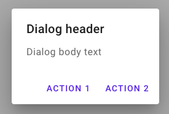

## `<dialog>`

### 兼容性
from DSLv1.0

### 设计

代表一次弹窗动作

### 属性

- `title` 表示弹窗标题，内容为字符串
- `msg` 必需。表示弹窗内容，内容为字符串
- `positiveBtn` 必需。具有引导向的按钮文案内容
- `negativeBtn` 负向引导的按钮文案内容

### 子节点

- `<onPositive>` 当引导向按钮被用户点击，可包括动作节点作为子节点
- `<onNegative>` 当负向引导按钮被用户点击，可包括动作节点作为子节点