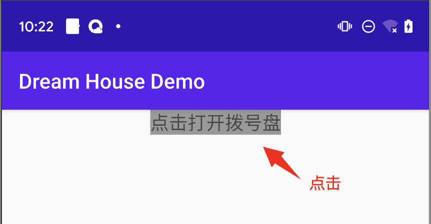
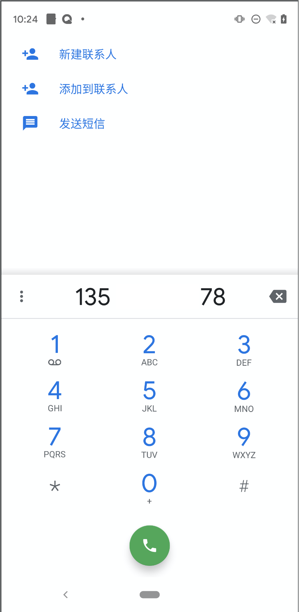
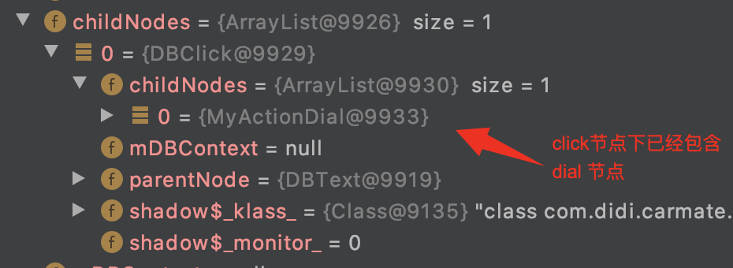

## 如何扩展Android动作标签-入门篇

android扩展一个动作标签，包含如下几个步骤：
1. 基类继承
2. 实现相关模板方法
3. 注册自定义的UI标签
4. 编写dsl
5. 功能实现

接下来以一个简单的demo来描述action标签的扩展过程，我们会扩展一个打开系统拨号盘的动作组件。界面上放置一个按钮，点击按钮后会打开系统拨号面板，效果如下：




### 1. 基类继承
定义类 `MyActionDial` 继承至基类 `DBAction`
```
public class MyActionDial extends DBAction {
}
```

### 2. 实现相关模板方法
- 实现 `getNodeTag()` 方法，返回node名称，将会在dsl里使用
- 实现节点的 Creator 类，

```
public class MyActionDial extends DBAction {
    public static String getNodeTag() {
        return "dial";
    }

    public static class NodeCreator implements INodeCreator {
        @Override
        public MyActionDial createNode() {
            return new MyActionDial();
        }
    }
}
```

### 3. 注册自定义的Action标签
将自定义的Action标签注册到DreamBox，在App启动时进行注册
```
public class DemoApplication extends Application {
	......
    @Override
    public void onCreate() {
        super.onCreate();
        ......;
        DreamBox.getInstance().registerDBNode(MyActionDial.getNodeTag(), new MyActionDial.NodeCreator());
    }
}
```

### 4. 编写dsl
动作的执行需要在某个事件发生时来触发，这里我们将动作的触发放在 `单击文本` 事件里。

按照模板方法定义的节点名称编写dsl，`dial` 标签即为第2步 `getNodeTag()` 方法返回的字符串。
```
<dbl>
    <render>
        <text id="txt" src="点击打开拨号盘" size="18dp" leftToLeft="parent" rightToRight="parent" backgroundColor="#999999">
            <onClick>
                <dial />
            </onClick>
        </text>
    </render>
</dbl>
```

如果此时调试查看节点树，会发现自定义的 `dial` 节点已经在其中了



### 5. 功能实现
接下来完成细节功能的实现

#### 5.1 动作处理
要想在某个事件发生时执行某个动作，需要覆写父类的 `doInvoke` 方法。
```
public class MyActionDial extends DBAction {
    @Override
    protected void doInvoke() {
        // 点击文本按钮，将会调用此方法
    }

    public static String getNodeTag() {
        return "dial";
    }

    public static class NodeCreator implements INodeCreator {
        @Override
        public MyActionDial createNode() {
            return new MyActionDial();
        }
    }
}
```

点击文本按钮 `doInvoke` 方法会被触发，可在此方法里执行业务相关的逻辑。

#### 5.2 属性处理
通过给 `MyActionDial` 添加一个 phoneNumber 属性，来展示属性的扩展, `phoneNumber` 属性用于定义电话号码，会传到拨号盘。

```
<dbl>
    <render>
        <text id="txt" src="点击打开拨号盘" size="18dp" leftToLeft="parent" rightToRight="parent" backgroundColor="#999999">
            <onClick>
                <dial phoneNumber="13512345678" />
            </onClick>
        </text>
    </render>
</dbl>
```

Java侧扩展组件代码，如下
```
public class MyActionDial extends DBAction {
    private String phoneNumber;

    @DBDomAttr(key = "phoneNumber")
    public void setPhoneNumber(String phoneNumber) {
        this.phoneNumber = phoneNumber;
    }

    @Override
    protected void doInvoke() {
        MyDemo.getInstance().showDialPanel(mDBContext.getContext(), phoneNumber);
    }
	......
}
```

这里有个新的知识点，`@DBDomAttr(key = "phoneNumber")` 注解。这个注解会自动抓取dsl里`key`指定的那个属性的值，同时调用被注解的方法，属性的值将作为参数传进来。

dsl属性 `phoneNumber` 被赋值 `13512345678`，所以 `13512345678` 会被作为参数传到 `setPhoneNumber` 方法。新增String类型的变量 `phoneNumber` ，用来保存dsl定义的 phoneNumber 的内容。接下来 `doInvoke` 方法里调用业务层提供的 `showDialPanel` 能力即可得到文章开头的展示效果。

以上是android组件扩展的入门篇，以一个简单的小例子引领使用者快速理解一些基本概念。