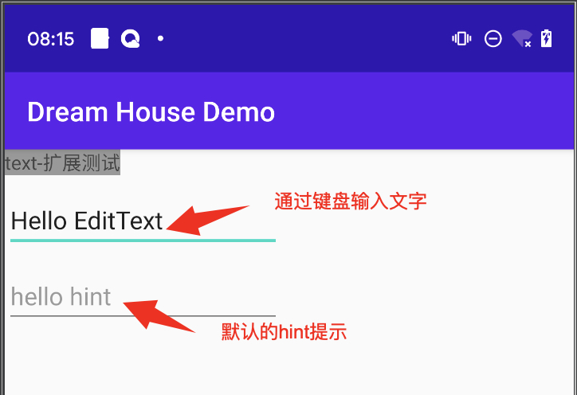
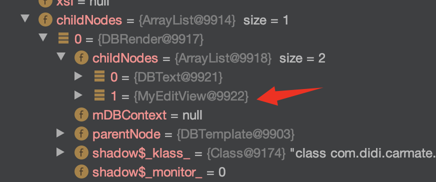
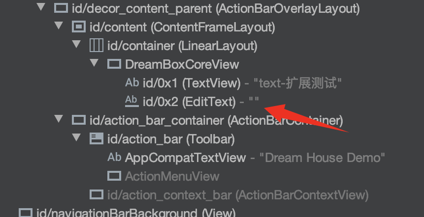
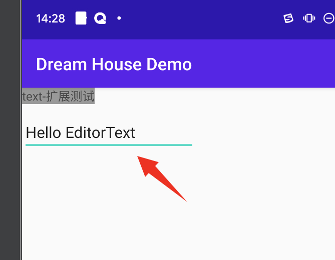
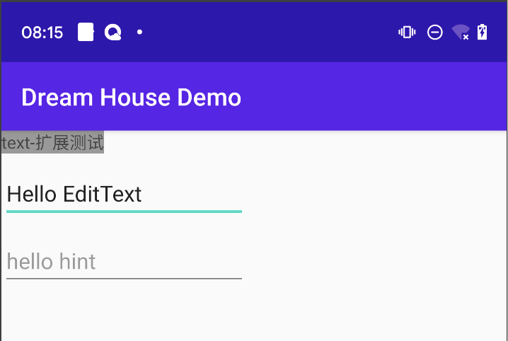

## 如何扩展Android UI标签-入门篇

android扩展一个UI标签，包含如下几个步骤：
1. 基类继承
2. 实现相关模板方法
3. 注册自定义的UI标签
4. 编写dsl
5. 功能实现

接下来以一个简单的demo来描述UI标签的扩展过程，我们会扩展一个编辑框UI标签组件，然后在界面上放置两个扩展的编辑框，一个输入一些文字，另一个显示hint提示



### 1. 基类继承
定义类 `MyEditView` 继承至基类 `DBBaseView`，基类需要提供一个native标签实现类作为泛型参数，这里只是简单演示，所以使用了系统自带的 EditText 作为标签的实现类。
```
public class MyEditView extends DBBaseView<EditText> {
}
```

### 2. 实现相关模板方法
- 实现 `getNodeTag()` 方法，返回node名称，将会在dsl里使用
- 实现节点的 Creator 类，

```
public class MyEditView extends DBBaseView<EditText> {
    public static String getNodeTag() {
        return "edit_view";
    }

    public static class NodeCreator implements INodeCreator {
        @Override
        public MyEditView createNode() {
            return new MyEditView();
        }
    }
}
```

### 3. 注册自定义的UI标签
将自定义的UI标签注册到DreamBox，在App启动时进行注册
```
public class DemoApplication extends Application {
	......
    @Override
    public void onCreate() {
        super.onCreate();
        ......
        DreamBox.getInstance().registerDBNode(MyEditView.getNodeTag(), new MyEditView.NodeCreator());
    }
}
```

### 4. 编写dsl
按照模板方法定义的节点名称编写dsl，`edit_view` 标签即为第2步 `getNodeTag()` 方法返回的字符串
```
<dbl>
    <render>
        <text id="txt" src="text-扩展测试" backgroundColor="#999999" />
        <edit_view width="200dp" topToBottom="txt" marginTop="10dp" />
    </render>
</dbl>
```

如果此时调试查看节点树，会发现自定义的edit_view节点已经在其中了




### 5. 功能实现
接下来完成细节功能的实现

#### 5.1 渲染处理
要想将View显示到界面上，需要覆写父类的如下两个方法:
- `createView`，此方法主要是返回一个native标签实现类的实例
- `doRender`，此方法处理数据和native标签实现类的绑定及其他可自定义实现的处理逻辑

```
public class MyEditView extends DBBaseView<EditText> {
    @Override
    protected EditText createView(DBRootView parentView) {
        return new EditText(parentView.getContext());
    }

    @Override
    protected void doRender(EditText editText) {
        super.doRender(editText);
    }

    public static String getNodeTag() {
        return "edit_view";
    }

    public static class NodeCreator implements INodeCreator {
        @Override
        public MyEditView createNode() {
            return new MyEditView();
        }
    }
}
```
这里以系统原生的 `EditText` 作为编辑框组件，也可以实现自己的EditText组件。在 `createView` 方法里，实例化一个EditText，框架会将它添加到父布局里。

此时通过 LayoutInspector 工具查看UI树，能看到EditText已经在UI树里了，运行程序已经可以查看到效果。点击输入框输入 `Hello EditorText`，得到如图效果

 


#### 5.2 属性处理
通过给MyEditText添加一个hint效果，来展示属性的扩展。

先在dsl里新添加一个MyEditText组件，并新增属性 `hint` 赋值为 hello hint
```
<dbl>
    <render>
        <text id="txt" src="text-扩展测试" backgroundColor="#999999" />
        <edit_view id="edit" width="200dp" topToBottom="txt" marginTop="10dp />
        <edit_view width="200dp" topToBottom="edit" marginTop="10dp" hint="hello hint" />
    </render>
</dbl>
```

Java侧扩展组件完整代码，如下
```
public class MyEditView extends DBBaseView<EditText> {
    private String hint;

    @DBDomAttr(key = "hint")
    public void setHint(String hint) {
        this.hint = hint;
    }

    @Override
    protected EditText createView(DBRootView parentView) {
        return new EditText(parentView.getContext());
    }

    @Override
    protected void doRender(EditText editText) {
        super.doRender(editText);

        editText.setHint(hint);
    }
	
	public static String getNodeTag() {
		return "edit_view";
	}

	public static class NodeCreator implements INodeCreator {
		@Override
		public MyEditView createNode() {
			return new MyEditView();
		}
	}
}
```

这里有个新的知识点，`@DBDomAttr(key = "hint")` 注解。这个注解会自动抓取dsl里`key`指定的那个属性的值，同时调用被注解的方法，属性的值将作为参数传进来。

dsl属性 `hint` 被赋值hello hint，所以hello hint会被作为参数传到 `setHint` 方法。新增String类型的变量 `hint` ，用来保存dsl定义的hint的内容。只需要在 `doRender` 方法里调用EditText的 `setHint` 方法即可得到文章开头的展示效果：



以上是android组件扩展的入门篇，以一个简单的小例子引领使用者快速理解一些基本概念。