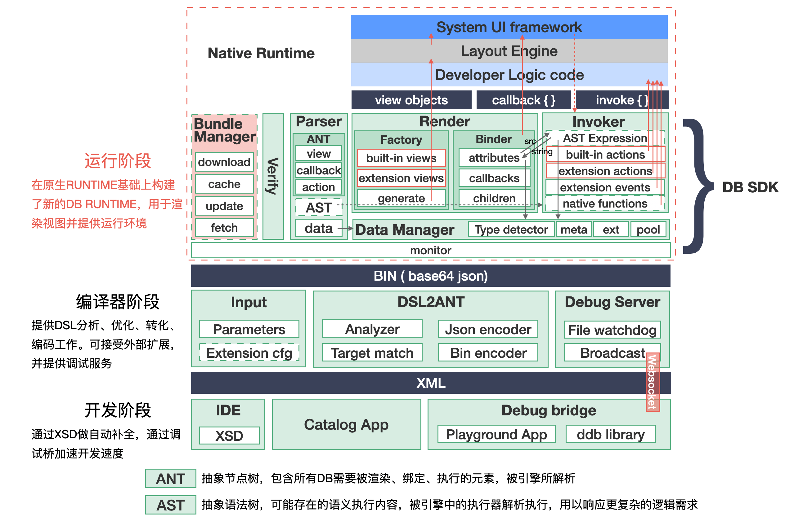

## 设计全景与ROADMAP

>此文档展示`DreamBox`最新的架构设计和未来功能、开发重点的规划设想，框架处于发展中，当前设计不代表实际实现，仅做参考作用。

红色区域代表当前功能不强壮、欠缺的，将来意图补全、着力发展的部分：
1. 尽管前边说过，发布环节涉及具体的业务环境与需求形态，但是无论如何，渲染模板数据在本地的缓存机制是有必要的
2. 内置组件和内置功能，以及必要的社区扩展是将来会持续发展健壮的
3. LayoutEngine目前两端采用分别映射、适配的具体实现，将来期待的方案是通过C++进行统一

图中展示内容对照代码可能不尽准确，只是代表了粗粒度上的发展状况和期待。