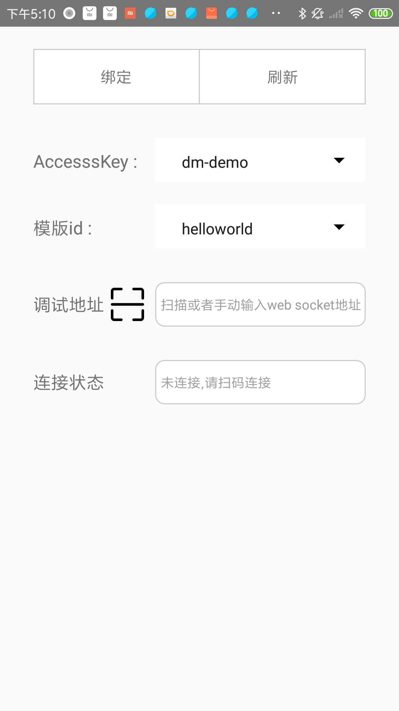
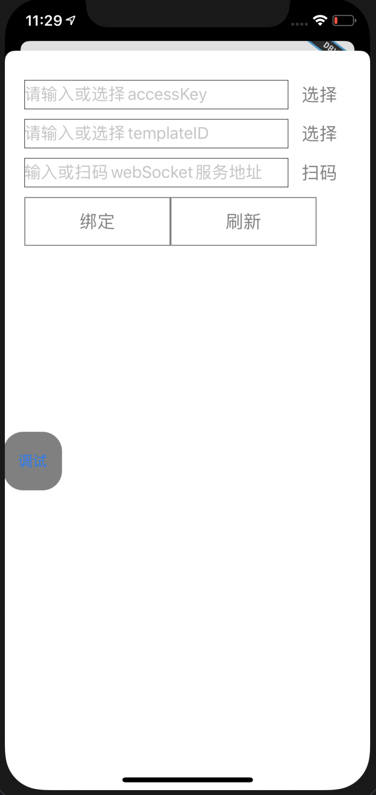

## 集成调试工具

### Android ：

#### 工程中引入依赖 （建议debug模式下使用）：

```
    debugImplementation 'com.didiglobal.dreambox:db-debug-tool:1.0.0'
```

打出的apk包就会多出一个叫“DB调试工具”的入口，在主工程中打开一个DB页面，然后退后台进入“DB调试工具”就会看到如下界面，一个DB页面对应一个模版id（如果没有打开DB页面AccessKey跟模版id会显示无数据），然后扫描或者手动输入web socket地址，连接成功后点击绑定，这样就可以回到工程中的DB页面进行调试，修改结果会实时渲染到页面上。点击调试页面的“刷新”会断开与web socket的连接，重新获取需要调试的DB页面。



### iOS ：

#### 工程中引入依赖 （建议debug模式下使用）：

```
pod 'DBDebugTool', :git => 'git@github.com:didi/dreambox.git'
```

如需DB的debug功能，在启动时手动打开显示debugTool的悬浮开关

```
[[DBDebugService shareInstance] showDebugbutton];
```

一个DB页面对应一个模版id（如果没有打开DB页面AccessKey跟模版id会显示无数据），然后扫描或者手动输入web socket地址，连接成功后点击绑定，这样就可以回到工程中的DB页面进行调试，修改dsl保存后，会实时渲染到页面上。点击调试页面的“刷新”会断开与web socket的连接，重新获取需要调试的DB页面。


