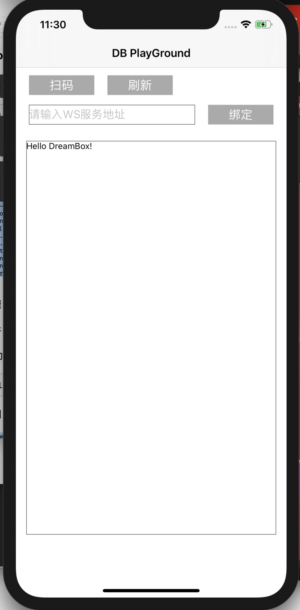
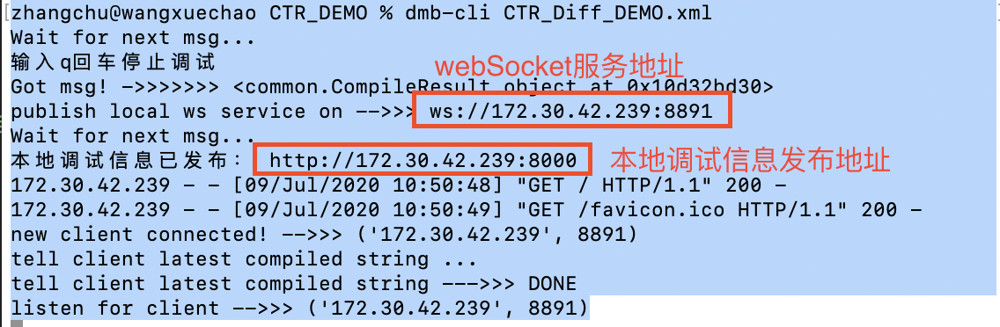
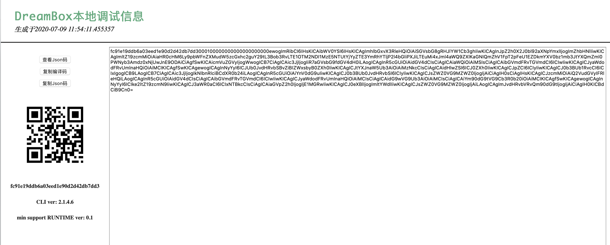
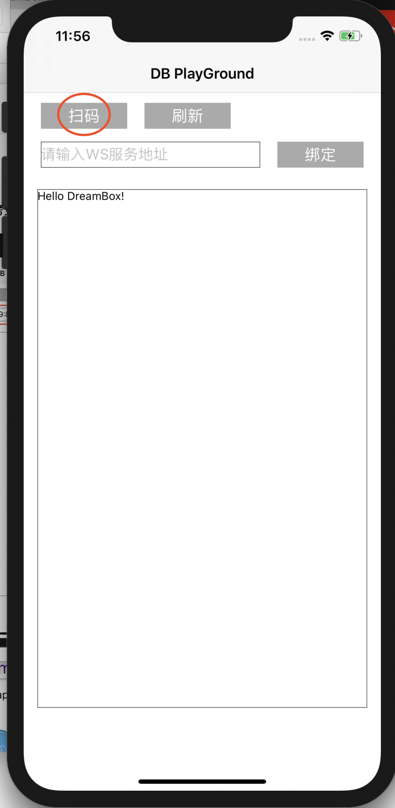
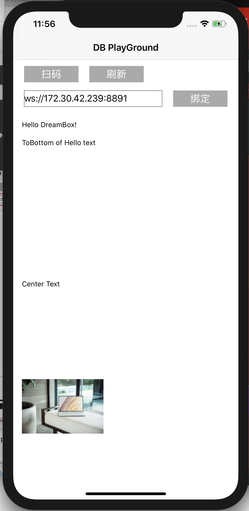
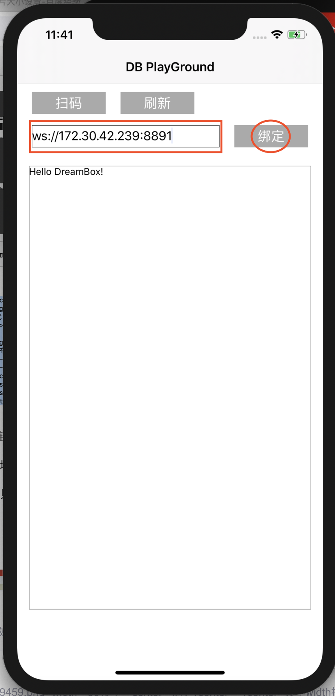

## Playground


### 一、下载&集成

#### iOS ：

````
https://github.com/didi/DreamBox/playground-ios
pod install
````
运行结果




#### Android ：

扫码下载：


### 二、使用
#### Step1 启动长链接服务

1. 前提条件：环境准备就绪 详见[环境准备](environment.md)、[CLI使用说明](cli.md)
2. 将以下代码保存为demo.xml文件
    ```xml
    <dbl xmlns:xsi="http://www.w3.org/2001/XMLSchema-instance">
        <meta hello_text="Hello DreamBox!" right_btn_visible="false" img_src="https://images.unsplash.com/photo-1593642531955-b62e17bdaa9c?ixlib=rb-1.2.1&ixid=eyJhcHBfaWQiOjEyMDd9&auto=format&fit=crop&w=1650&q=80" />
        <render>
            <text id="tv1" src="${hello_text}" leftToLeft="parent" rightToRight="parent"></text>
            <text id="tv2" src="ToBottom of Hello text" marginTop="33dp" topToTop="tv1"></text>
            <button src="Center Button" topToBottom="tv2" leftToLeft="parent"></button>
            <text src="Center Text" leftToLeft="parent" rightToRight="parent" topToTop="parent" bottomToBottom="parent"></text>
            <image src="${img_src}" leftToLeft="parent" bottomToBottom="parent" width="150dp" height="150dp"></image>
        </render>
    </dbl>
    ```
3. 启动长链接服务
    ```
    dmb-cli demo.xml
    ```
输出示例


#### Step2 绑定长链接服务

方式1：打开本地调试信息发布地址链接，获得二维码
 

扫码；

 


方式2：直接拷贝webSocket服务地址，输入，绑定；

 
