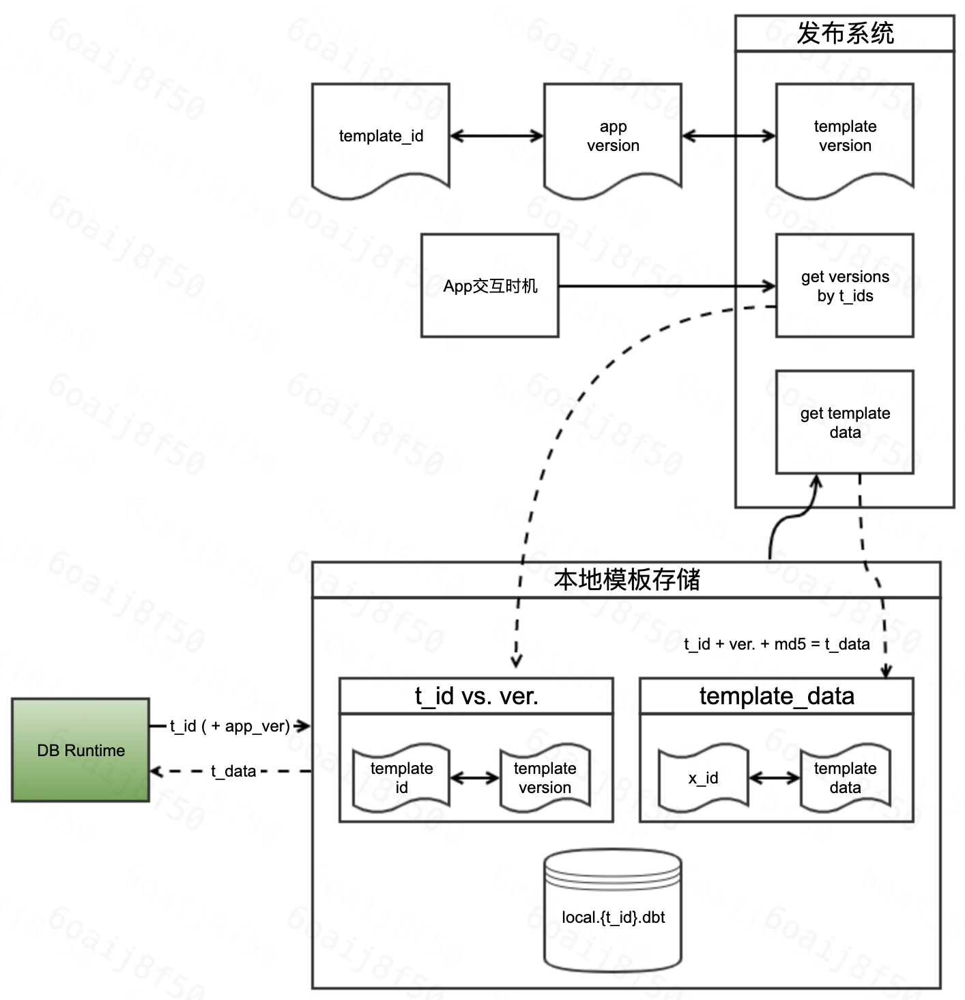

## 发布方案建议

建议的发布方案设计

### 设计详情

#### 索引维度

前边API文档中提到过，会通过接入方开发者在运行时传入的`template_id`和当前App的verison通过发布系统的实现唯一定位到一个模板数据。但在实际实现中，应该还需要加入另一个维度的索引：模板版本。通过这三个参数（维度）唯一定位到一个模板数据。
 
引入“模板版本”的原因是：不可以每次都到发布系统去实时拉取模板数据。第一，考虑QPS；第二，考虑流量

#### 云端的发布系统具备的功能

1. 通过`t_id`们批量获取对应模板版本的接口能力。“模板版本”数据对于一线开发者应该是无感知的，其完全可以在发布系统内部闭环。在适合的App交互时机：
   1. 应用启动
   2. 前后台切换
   3. 每隔N时长
   4. 某些业务关键节点
   去主动的拉取此接口，将返回的模板数据存储到本地存储系统中，作为一张表
2. 通过`t_id`、`app_version`、`t_ver`定位唯一模板数据的接口能力

#### 终端本地的模板存储系统

结合云端发布系统所具备的两种能力。终端也需要配合在本地做好缓存的工作。
 
- 首先缓存的是刚刚提到过的模板ID与模板版本的表
- 之后缓存的是已经获取到的具体模板数据，这部分的ID应包含模板ID、模板版本，为了校验正确性，建议也加入MD5

> 以上，就是DB的闭环逻辑设计中所提到的抽象发布系统，这部分能力被DB认为是顶层发布系统能力，放在接入层中待接入方具体实现

### 逻辑总结

DB Runtime拿着接入方开发者传入的`t_id`以及自动获取的当前App版本号去顶层发布能力中获取`t_data`，这是DB Runtime的核心诉求：
- 首先，这两个数据（`t_id`、`app_version`）进入终端的发布系统相关代码逻辑中，因为`app_version`对于终端来说都是一致的数据，所以此时真正有效的只有`t_id`。所以，对应了上述所表达的，终端发布系统代码中应该存留着`t_id`与其`t_ver`对应的数据表
- 此时眼前的数据是`t_ver`。显而易见的，此时的`t_ver`如果不是最新的，那么最终获取到的模板数据也不会是最新的。所以，在什么时机、以什么逻辑请求云端发布系统的第一个能力来更新`t_ver`是接入方实现发布系统时着重需要考虑的事情
- 然后，对应着终端本地的第二张表：根据`t_id`、`t_ver`定位到具体模板数据，若存在，则使用推荐的ID组装方式中的MD5对其做准确性校验；若不存在，则调用云端发布系统的第二个能力获取真实模板数据（此时还需携带`app_ver`。获取到数据后，入表
- 完成上述步骤后，若存在有效数据，则返回正常渲染；若不存在，则此次渲染落空

> END