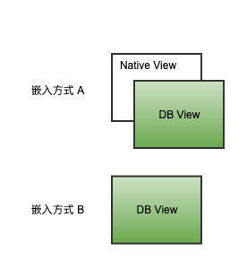

## 快速入门
接入方在集成后，如何使用DreamBox Runtime来达成一个动态化布局

### 嵌入

在原生布局中嵌入DBView（DBView为代指用名，具体类名以SDK实现为准），嵌入方式参考下图：



- 方式A。将DBView遮罩于原生View上，当已发版的原生视图已无法满足新需求时，预置DBView可直接接管，在线生效新需求
- 方式B。随版本直接内置DBView及渲染模板数据，当有新需求变化时可在线覆盖模板数据即时生效

### 编辑模板

```xml
<dbl xmlns:xsi="http://www.w3.org/2001/XMLSchema-instance" xsi:noNamespaceSchemaLocation="https://db-xsd.oss-cn-beijing.aliyuncs.com/dbl.xsd">
    <render>
        <text src="Hello DreamBox!"></text>
    </render>
</dbl>
```

经过编译器编译后产生：
```
db806418fdb1cbab87eff1954afc3add000100000000000000000000ewogImRibCI6IHsKICAicmVuZGVyIjogWwogICB7CiAgICAic3JjIjogIkhlbGxvIERyZWFtQm94ISIsCiAgICAidHlwZSI6ICJ0ZXh0IgogICB9CiAgXQogfQp9
```

### 内置模板

创建文本文件，将编译后字符串粘贴在文件中并保存，命名为`local.hellodb.dbt`。将此文件内置于App文件系统中。
##### Android文件放置
存放在应用 assets 目录下

比如：模板为 `hello` ，命名为 `local.hello.dbt` 文件即可，文件内容为 cli 编译出的最终数据

如果要自定义模板存放位置，请参考`wrapper`章节，实现自定义的模板加载方式。

##### iOS文件放置
如果你是在mainBundle下放置，直接拖拽文件即可。如果非mainBundle下放置，那么需要为你注册的wrapper设置bundle和文件所在路径，让wrapper能找到本地模板

````
    wrapper.bundle = XXBundle;
    wrapper.directoryPath = @"XX/DreamBoxTemplate";
````

### Coding

在原生开发环境中，获取到嵌入的DBView实例后，调用DBView的渲染接口，`template_id`参数传入`hellodb`。运行查看效果。

### 效果

嵌入DBView的位置上展示了`Hello DreamBox!`的文字。